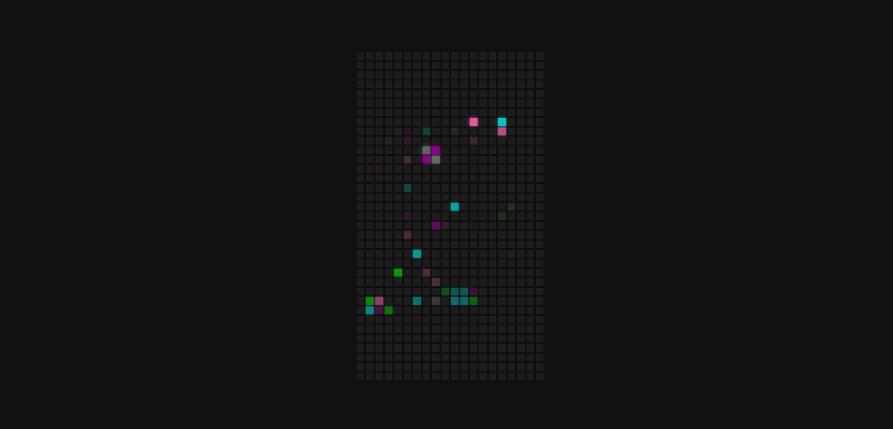

# 5 простых плагинов на vallina js без использования framework`ов

## Цель: Практика написания простых плагинов
## Технологии: Html, Css, Javascript

### Плагины:
- Плагин слайдер с разварачиваниванием картинки
- Плагин слайдер с одновременным переключением двух картинок
- Драг и Дроп плагин
- Плагин игра змейка
- Плагин игра для тренировки aim

### Плагин слайдер с разварачиваниванием картинки

### Плагин слайдер с одновременным переключением двух картинок

### Драг и Дроп плагин

### Плагин игра змейка

### Плагин игра для тренировки aim

